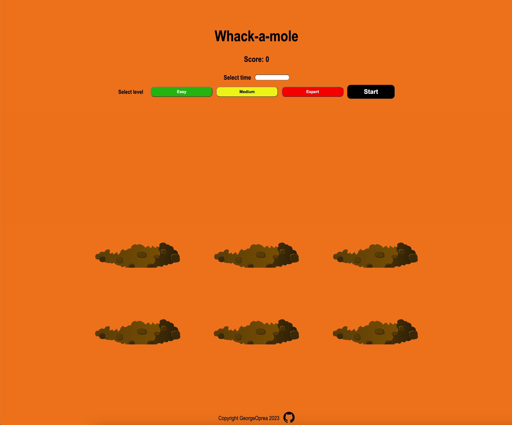
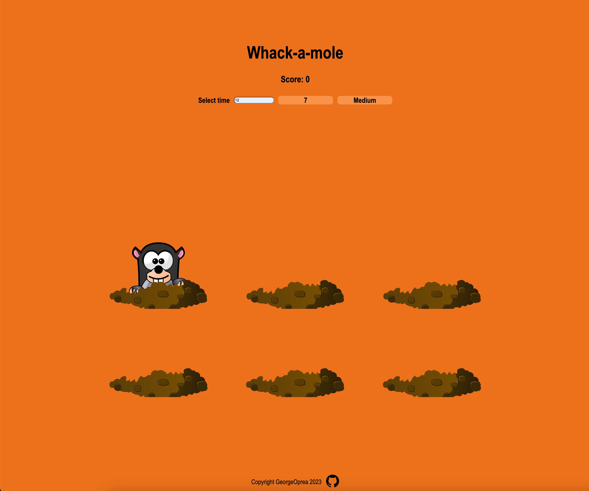

## [Whack-a-mole](https://georgeoprea1.github.io/whack-a-mole/)

A [whack-a-mole](https://georgeoprea1.github.io/library/) game, created with HTML, CSS and JavaScript.

## Features

- Select the game time(seconds).
- Choose from 3 difficulty levels(easy, medium, expert).
- Responsive design.

## Technologies

- JavaScript
- CSS
- HTML

## Tools

- Visual Studio Code
- Git and GitHub
- ESLint + Airbnb JavaScript Style Guide
